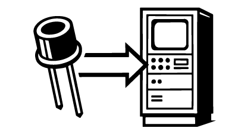
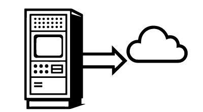
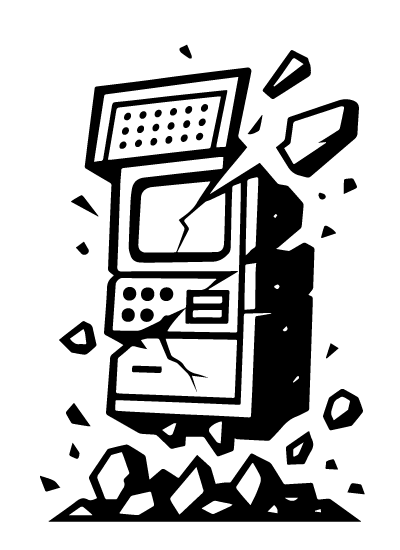

<table style="width: 100%; border-collapse: collapse; margin: 20px 0;">
  <tr>
    <th style="border: 1px solid #ddd; padding: 8px; text-align: left;">Has a nuke gone off?</th>
    <td id="nuke-status" style="border: 1px solid #ddd; padding: 8px;">Loading...</td>
  </tr>
  <tr>
    <th style="border: 1px solid #ddd; padding: 8px; text-align: left;">Last Monitor Update</th>
    <td id="last-update" style="border: 1px solid #ddd; padding: 8px;">Loading...</td>
  </tr>
  <tr>
    <th style="border: 1px solid #ddd; padding: 8px; text-align: left;">Total Minutes Monitored</th>
    <td id="total-minutes" style="border: 1px solid #ddd; padding: 8px;">Loading...</td>
  </tr>
</table>

<link rel="stylesheet" href="https://unpkg.com/leaflet@1.9.4/dist/leaflet.css" />

The Bhangmeter V2 uses a HSN-1000L Nuclear Event Detector device to detect the gamma ray burst from the explosion.

  

Upon the pulse hitting the detector in the Bhangmeter the information is received by the on-board computer

  

After being detected by the on-board computer the information is uploaded to the cloud for storage in perpetuity

  

A short time later the blastwave will hit the Bhangmeter V2 at which time it will have completed its mission

  

  

To build your own Bhangmeter V2 please follow the below instructions

  

