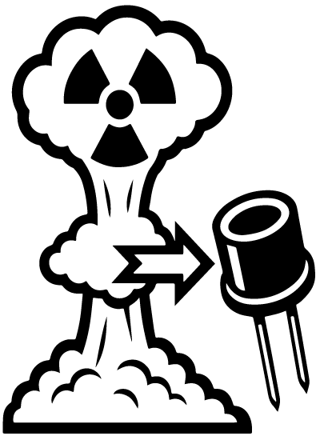

<table style="width: 100%; border-collapse: collapse; margin: 20px 0;">
  <tr>
    <th style="border: 1px solid #ddd; padding: 8px; text-align: left;">Has a nuke gone off?</th>
    <td id="nuke-status" style="border: 1px solid #ddd; padding: 8px;">Loading...</td>
  </tr>
  <tr>
    <th style="border: 1px solid #ddd; padding: 8px; text-align: left;">Last Monitor Update</th>
    <td id="last-update" style="border: 1px solid #ddd; padding: 8px;">Loading...</td>
  </tr>
  <tr>
    <th style="border: 1px solid #ddd; padding: 8px; text-align: left;">Total Minutes Monitored</th>
    <td id="total-minutes" style="border: 1px solid #ddd; padding: 8px;">Loading...</td>
  </tr>
</table>

<link rel="stylesheet" href="https://unpkg.com/leaflet@1.9.4/dist/leaflet.css" />

The Bhangmeter V2 employs an HSN-1000L Nuclear Event Detector to register the initial gamma ray burst from a nuclear explosion. This burst travels at the speed of light and reaches the detector almost instantly. It is followed shortly by the neutron flux—traveling at roughly 10% the speed of light—and then the blast wave, which moves much slower at Mach 1.5 to 3, arriving several milliseconds to seconds later depending on the distance.

  

The HSN-1000L detects the gamma burst and outputs an active-low pulse, which the microcontroller interprets as a "Nuclear Event Detection" (NED). This triggers a routine that logs the exact time of the event.

  

Once detected by the onboard computer, the NED timestamp is uploaded to the cloud for permanent storage.

  

A short time later—depending on the distance from the detonation site—the blast wave reaches the Bhangmeter V2, marking the completion of its mission. Its specialized polymer casing provides brief ablative cooling upon impact.

  

To build your own Bhangmeter V2 please follow the below instructions

  

  

  

  

  

  

